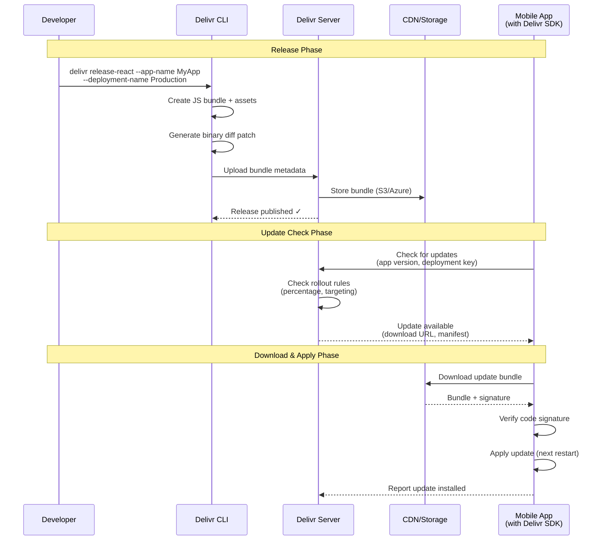

# Delivr

**Mobile DevOps Platform · Self-Hosted · Open Source**

[](LICENSE.txt)

[delivr.live](https://delivr.live)

---

## The Problem: Mobile Release Bottlenecks

**Releasing mobile apps is slow, risky, and inflexible:**

1. **App Store Review Delays** – Critical bug fixes wait 24-72 hours for Apple/Google approval
2. **All-or-Nothing Releases** – One release version for all users; no gradual rollouts with instant rollback
3. **No Rapid Iteration** – Can't A/B test features or deploy multiple updates per day
4. **Build Complexity** – Setting up iOS/Android builds requires significant DevOps expertise
5. **Release Coordination Chaos** – Managing releases across App Store, Play Store, and internal teams requires manual coordination

**For React Native teams specifically:**  
You can't update JavaScript/assets without going through the full app store review cycle, even though the native code hasn't changed. This makes rapid iteration nearly impossible.

---

## The Solution: Delivr

Delivr is a **self-hosted mobile DevOps platform** that eliminates release bottlenecks through three pillars:

```
┌─────────────────────────────────────────────────┐
│         Delivr Mobile DevOps Platform          │
├─────────────────────────────────────────────────┤
│  Build Orchestration  │  Release Management    │
│   (Coming Soon)       │   (Coming Soon)        │
│   Any Mobile App      │   Any Mobile App       │
├─────────────────────────────────────────────────┤
│      Over-the-Air Updates (Available Now)      │
│            React Native                         │
└─────────────────────────────────────────────────┘
```

**Available Now:**
- **Over-the-Air (OTA) Updates** for React Native – Deploy JavaScript/asset updates in minutes, bypassing app store reviews

**Coming Soon:**
- **Build Orchestration** – Automated iOS/Android builds from any Git repository
- **Release Management** – Coordinated releases across App Store, Play Store, and OTA channels with approval workflows

---

## When Delivr is the Right Choice

✅ **You should use Delivr if:**

- You have **React Native apps in production** and need to fix bugs or deploy features without app store delays
- You need **emergency hotfixes** that can't wait 24-72 hours for review
- You want **gradual rollouts** (1% → 10% → 100%) with instant rollback if issues arise
- You require **self-hosted infrastructure** for data sovereignty or compliance reasons
- You want to **A/B test features** without submitting multiple app versions
- You need **separate staging and production** OTA deployments for testing before full release
- You're building a **mobile DevOps pipeline** and want a unified platform for builds, releases, and OTA updates (future)

---

## When Delivr is NOT the Right Choice

❌ **Do NOT use Delivr if:**

- **You're building a pure native app** (Swift/Kotlin) – OTA updates only work for JavaScript-based frameworks like React Native. Native code changes still require app store submissions.
- **You need to update native modules or permissions** – These require full app store reviews; OTA can't help.
- **You're starting a greenfield React Native project** – Consider [Expo](https://expo.dev/) first. Expo has simpler setup and includes OTA updates out-of-the-box. Delivr is better for existing apps that need self-hosted infrastructure or have already ejected from Expo.
- **You only need simple config changes** – [Firebase Remote Config](https://firebase.google.com/products/remote-config) or feature flags are simpler for toggling settings without code updates.
- **You're uncomfortable with self-hosting** – Delivr requires managing Docker containers, databases, and storage. If you prefer fully managed services, consider [Microsoft CodePush](https://github.com/microsoft/code-push) (though it's in maintenance mode) or [Expo Updates](https://docs.expo.dev/eas-update/introduction/).
- **Your team has < 5 developers** – The operational overhead of self-hosting may outweigh the benefits for very small teams.

**Key Constraint:**  
OTA updates must comply with App Store and Play Store policies. You cannot change the app's primary purpose or introduce new permissions via OTA. See [Store Guidelines](delivr-sdk-ota/docs/store-guidelines.md) for details.

---

## How It Works

### OTA Update Flow (Available Now)



### Key Concepts

1. **Deployments** – Separate environments (e.g., Staging, Production) with independent release channels
2. **Rollout Percentages** – Gradually expose updates (e.g., 5% of users, then 50%, then 100%)
3. **Mandatory Updates** – Force users to install critical updates before using the app
4. **Delta Patching** – Only download changed files using binary diffs (powered by bsdiff algorithm)
5. **Code Signing** – Cryptographically verify updates haven't been tampered with
6. **Automatic Rollback** – SDK detects crashes after an update and auto-reverts to previous version

**What can be updated via OTA?**

| ✅ No App Store Review Needed | ❌ Requires App Store Submission |
|-------------------------------|-----------------------------------|
| JavaScript/TypeScript code    | Native code (Swift, Kotlin, etc.) |
| React components & UI         | Native modules & dependencies     |
| Images & assets               | App permissions                   |
| JSON configuration            | App icons & launch screens        |
| Styling & themes              | App name or bundle ID             |

---

## Alternatives and When to Use Them

Delivr is not the only solution for mobile releases. Here's when to consider alternatives:

| Alternative | When to Use It | When NOT to Use It |
|-------------|----------------|---------------------|
| **[Expo](https://expo.dev/)** | Starting a new React Native project; want simplest setup; okay with managed workflow | Already ejected from Expo; need custom native modules; require self-hosted infrastructure |
| **[Expo EAS Update](https://docs.expo.dev/eas-update/introduction/)** | Using Expo; okay with Expo's cloud hosting; want fully managed service | Need self-hosted solution; already using plain React Native |
| **[Microsoft CodePush](https://github.com/microsoft/code-push)** | Legacy projects already using CodePush (note: in maintenance mode) | Starting new projects (CodePush is no longer actively developed) |
| **[Firebase Remote Config](https://firebase.google.com/products/remote-config)** | Only need to toggle feature flags or change config values; no code updates needed | Need to update app logic or UI components |
| **Standard App Store Release** | Updating native code; adding permissions; changing app's core functionality | Need to fix critical bugs quickly; want to A/B test features |

**Why choose Delivr over alternatives?**

- **Self-hosted** – Full control over infrastructure, data stays on your servers (Expo/CodePush are cloud-only)
- **Open source** – Audit code, customize behavior, no vendor lock-in
- **Production-proven** – Battle-tested at scale in high-traffic environments
- **Future-proof** – Expanding to build orchestration and release management for all mobile apps

---

## Quick Start

**Prerequisites:** Docker Desktop (running), Node.js 18+

```bash
# 1. Clone the monorepo
git clone https://github.com/dream-horizon-org/delivr.git
cd delivr

# 2. Launch all services
chmod +x launch_script.sh
./launch_script.sh
```

The script will:
- ✅ Validate environment and resolve port conflicts
- ✅ Start API server, web dashboard, database, and cache
- ✅ Seed initial data for testing

**Access Points:**
- 🌐 **Web Dashboard:** http://localhost:3000
- 🔌 **API Server:** http://localhost:3010

**→ Complete setup guide:** [delivr.live/dota/full-setup](https://delivr.live/dota/full-setup)

---

## What's Included

### ✅ Production Ready (Available Now)

**Pillar 1: Over-the-Air Updates**
- ✅ **Instant Deployment** – Push JS/asset updates in minutes, not days
- ✅ **Delta Patching** – Binary diffs for significantly smaller downloads
- ✅ **Staged Rollouts** – Gradual releases with percentage control (e.g., 5% → 50% → 100%)
- ✅ **Mandatory Updates** – Force critical fixes immediately
- ✅ **Automatic Rollback** – SDK auto-reverts crashes within 5 minutes of update
- ✅ **Version Targeting** – Deploy to specific app versions using semver (e.g., `1.2.*`)
- ✅ **Multi-Deployment** – Separate Staging and Production environments
- ✅ **Code Signing** – Cryptographic verification of updates
- ✅ **Brotli Compression** – Additional 20-30% size reduction on bundles
- ✅ **Hermes Bytecode Optimization** – Smaller patches with base bytecode tracking

**Web Dashboard**
- ✅ **App Management** – Create and manage multiple apps
- ✅ **Deployment Control** – Manage Staging and Production deployments independently
- ✅ **Release History** – Track all deployed versions with metadata
- ✅ **Real-Time Analytics** – Monitor adoption, active versions, and crash reports
- ✅ **Rollout Control** – Adjust rollout percentages on the fly
- ✅ **OAuth Authentication** – Google, GitHub, Microsoft login

**CLI Tool**
- ✅ **Automated Releases** – CI/CD-friendly `delivr release-react` command
- ✅ **Binary Patching** – Create efficient patch bundles with bsdiff
- ✅ **Release Management** – Promote, rollback, and clear releases
- ✅ **Debug Tools** – `delivr debug` to troubleshoot deployments and SDK integration
- ✅ **Code Signing** – Sign releases with RSA keys

**Infrastructure & Platform**
- ✅ **Self-Hosted** – Deploy on your infrastructure with Docker Compose
- ✅ **Plugin System** – Pluggable storage (S3/Azure Blob/Local), database (MySQL/Postgres), auth
- ✅ **Multi-Cloud** – AWS, Azure, or on-premises deployment
- ✅ **CDN Support** – CloudFront and Azure CDN integration
- ✅ **Caching** – Multi-layer Redis (metadata) and Memcached (bundles)
- ✅ **Health Checks** – `/health` endpoint for monitoring
- ✅ **Battle-Tested** – Production-proven handling 1M+ daily requests
- ✅ **API Versioning** – v1 (legacy) and v2 (modern) endpoints

### 🔜 In Development (Coming Soon)

**Pillar 2: Release Management**
- 🔜 **Approval Workflows** – Multi-stage approval gates (QA → PM → Release Lead)
- 🔜 **Release Coordination** – Sync App Store, Play Store, and OTA releases in one flow
- 🔜 **Release Trains** – Scheduled, predictable release cycles (e.g., biweekly trains)
- 🔜 **Automated Guardrails** – Auto-rollback on error rate or crash thresholds
- 🔜 **Store Integration** – Track App Store Connect and Play Console submission status

**Pillar 3: Build Orchestration**
- 🔜 **Git Integration** – Webhook-triggered builds from GitHub, GitLab, Bitbucket
- 🔜 **Multi-Platform Builds** – Build iOS and Android from single repository
- 🔜 **Real-Time Logs** – Stream build logs to dashboard
- 🔜 **Artifact Management** – Store and manage `.ipa` and `.apk` files
- 🔜 **CI/CD Integration** – Works with Jenkins, CircleCI, GitHub Actions

**Platform Enhancements**
- 🔜 **GCP Deployment** – Google Cloud Platform support (in addition to AWS/Azure)
- 🔜 **Expo Plugin** – First-class Expo integration for bare workflow projects
- 🔜 **Device Testing** – Cloud-based device farms for automated QA
- 🔜 **Advanced Analytics** – User segmentation, cohort analysis, error tracking

---

## Monorepo Structure

This repository contains all Delivr components:

| Component | Purpose | Documentation |
|-----------|---------|---------------|
| **[delivr-server-ota/](delivr-server-ota/)** | Backend API server for OTA updates & orchestration | [README](delivr-server-ota/README.md) · [Setup](delivr-server-ota/docs/DEV_SETUP.md) · [Architecture](delivr-server-ota/docs/ARCHITECTURE.md) |
| **[delivr-sdk-ota/](delivr-sdk-ota/)** | React Native SDK for OTA updates | [README](delivr-sdk-ota/README.md) · [iOS Setup](delivr-sdk-ota/docs/setup-ios.md) · [Android Setup](delivr-sdk-ota/docs/setup-android.md) · [API](delivr-sdk-ota/docs/api-js.md) |
| **[delivr-web-panel/](delivr-web-panel/)** | Web dashboard for managing apps, deployments, and releases | [README](delivr-web-panel/README.md) |
| **[delivr-cli/](delivr-cli/)** | CLI for release management and deployments | [README](delivr-cli/README.md) · [CLI Reference](delivr-cli/CLI_REFERENCE.md) · [bsdiff](delivr-cli/bsdiff/README.md) |

---

## Deployment Options

| Environment | Storage | Database | Guide |
|-------------|---------|----------|-------|
| **Local Dev** | LocalStack (S3 emulator) | MySQL | [Complete Setup Guide](https://delivr.live/dota/full-setup) |
| **AWS** | S3 | RDS (MySQL/Postgres) | [Server Setup Guide](delivr-server-ota/docs/DEV_SETUP.md) |
| **Azure** | Blob Storage | Azure SQL | [Server Setup Guide](delivr-server-ota/docs/DEV_SETUP.md) |
| **On-Premises** | NFS/Local | MySQL/Postgres | [Server Setup Guide](delivr-server-ota/docs/DEV_SETUP.md) |

---

## Use Cases

**OTA Updates for React Native (Available Now):**
- **Instant Bug Fixes** – Deploy critical fixes in minutes instead of waiting days for app store approval
- **Security Patches** – Patch vulnerabilities immediately (e.g., fixing exposed API keys)
- **Feature Flags** – Enable/disable features remotely without app updates
- **A/B Testing** – Test variants with different user segments (e.g., 10% see new checkout flow)
- **Regional Rollouts** – Launch features in specific regions first (e.g., US → EU → Asia)
- **Rapid Iteration** – Deploy updates multiple times per day during development sprints

**Build & Release for All Mobile Apps (Coming Soon):**
- **Automated Build Pipelines** – Git push triggers iOS and Android builds automatically
- **Coordinated Releases** – Sync App Store and Play Store submissions with OTA updates
- **Release Management** – Multi-stage approvals (QA → PM → Release Lead) and automated guardrails
- **Works with any framework** – Native apps (Swift, Kotlin), React Native, Flutter, Ionic, etc.

---

## App Store Compliance

✅ **OTA updates comply with Apple App Store and Google Play Store policies:**

**Requirements:**
- Updates must contain **only JavaScript and assets** (no native code changes)
- Updates cannot **change the app's primary purpose** (e.g., can't turn a weather app into a social network)
- Updates must be **transparent to users** (no deceptive practices)

**What this means in practice:**
- ✅ You **can** fix bugs, update UI, add features in JavaScript
- ❌ You **cannot** add new permissions (e.g., location access) or update native SDKs

**Full compliance guide:** [Store Guidelines](delivr-sdk-ota/docs/store-guidelines.md)

---

## Performance & Scale

**OTA Update Performance:**
- **Update checks:** < 100ms with multi-layer caching (Redis + Memcached)
- **Download times:** Depend on patch size and network (typically 100KB-2MB for incremental updates)
- **Patch application:** Near-instantaneous (applied on next app restart)

**Efficiency:**
- **Delta patches** reduce download size by 70-90% vs. full bundles
- **Brotli compression** provides additional 20-30% size reduction
- **Example:** 10MB full bundle → 500KB patch for typical code change

**Scale:**
- Battle-tested in production handling **1M+ daily update checks**
- Supports **multi-region CDN distribution** (CloudFront, Azure CDN)
- **Horizontal scaling** via load balancers and multiple API instances

---

## Documentation

### Getting Started
- **[Complete Setup Guide](https://delivr.live/dota/full-setup)** – End-to-end setup from installation to first deployment

### SDK Integration
- [Delivr SDK Overview](delivr-sdk-ota/README.md)
- [iOS Setup Guide](delivr-sdk-ota/docs/setup-ios.md)
- [Android Setup Guide](delivr-sdk-ota/docs/setup-android.md)
- [JavaScript API Reference](delivr-sdk-ota/docs/api-js.md)
- [How OTA Updates Work](delivr-sdk-ota/docs/ota-updates.md)
- [Multi-Deployment Testing](delivr-sdk-ota/docs/multi-deployment-testing.md)
- [Store Guidelines](delivr-sdk-ota/docs/store-guidelines.md)

### CLI Usage
- [CLI Overview](delivr-cli/README.md)
- [CLI Command Reference](delivr-cli/CLI_REFERENCE.md)
- [Binary Patching (bsdiff)](delivr-cli/bsdiff/README.md)

### Server & Infrastructure
- [Server Overview](delivr-server-ota/README.md)
- [Development Setup](delivr-server-ota/docs/DEV_SETUP.md)
- [Environment Configuration](delivr-server-ota/api/ENVIRONMENT.md)
- [Architecture Details](delivr-server-ota/docs/ARCHITECTURE.md)

### Web Dashboard
- [Web Panel Overview](delivr-web-panel/README.md)

---

## Community & Support

- **GitHub Issues** → [Report bugs & request features](https://github.com/dream-horizon-org/delivr/issues)
- **GitHub Discussions** → [Ask questions & share ideas](https://github.com/dream-horizon-org/delivr/discussions)
- **Website** → [delivr.live](https://delivr.live)

---

## Contributing

We welcome contributions! Each component has its own contributing guide:

- [CLI Contributing](delivr-cli/CONTRIBUTING.md)
- [SDK Contributing](delivr-sdk-ota/CONTRIBUTING.md)
- [Server Contributing](delivr-server-ota/CONTRIBUTING.md)

---

## License

MIT License - see [LICENSE.txt](delivr-server-ota/LICENSE.txt)

---

## Security

Report security vulnerabilities: [SECURITY.md](delivr-sdk-ota/SECURITY.md)

---

**Made with ❤️ by [Dream Horizon](https://github.com/dream-horizon-org)**

**[Get Started](https://delivr.live/dota/full-setup)** · **[Documentation](https://delivr.live)**
