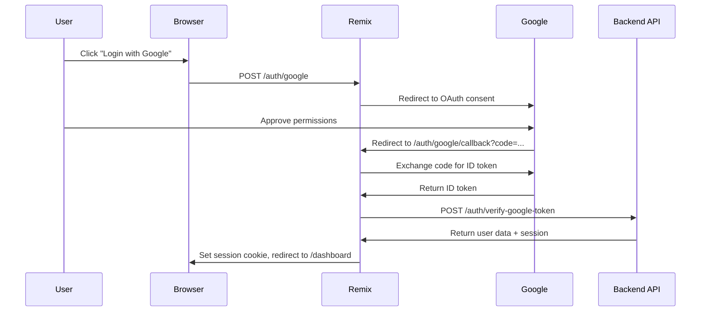

# 🎨 Delivr Web Panel - Frontend Architecture Guide

## 📋 Overview

**Delivr Web Panel** is a modern, full-stack web application built with **Remix** framework, providing a dashboard for managing:
- Organizations (Tenants)
- Applications (Apps)
- Deployments (OTA Updates)
- Access Tokens
- Team Collaborators
- (Future) Release Management

---

## 🏗️ Tech Stack

| Layer | Technology | Purpose |
|-------|------------|---------|
| **Framework** | Remix (v2.13+) | Full-stack React framework with file-based routing |
| **UI Library** | Mantine (v7.13+) | Component library (buttons, forms, modals, tables) |
| **Styling** | Tailwind CSS + Mantine CSS Modules | Utility-first CSS + scoped component styles |
| **State Management** | React Query (v3) | Server state management, caching, mutations |
| **Icons** | Tabler Icons | Icon library |
| **Authentication** | Remix Auth + Google OAuth | Session-based auth with Google Sign-In |
| **HTTP Client** | Axios | API calls to backend (`delivr-server-ota-managed`) |
| **Routing** | Remix File-Based Routing | Convention over configuration |
| **Build Tool** | Vite | Fast bundler and dev server |
| **Type Generation** | `routes-gen` | Auto-generates TypeScript route helpers |

---

## 📂 Project Structure

```
delivr-web-panel-managed/
├── app/                                # Main application code
│   ├── .server/                        # Server-only code (not bundled for client)
│   │   └── services/                   # Backend service integrations
│   │       ├── Auth/                   # Authentication service
│   │       │   ├── Auth.ts             # Remix Auth setup (Google OAuth)
│   │       │   ├── Auth.interface.ts   # User/Session types
│   │       │   └── Auth.utils.ts       # Auth utility functions
│   │       ├── Codepush/               # Backend API service
│   │       │   ├── index.ts            # Axios client, all API methods
│   │       │   ├── types.ts            # API request/response types
│   │       │   └── mockData.ts         # Mock data for testing
│   │       ├── Cookie/                 # Cookie storage utilities
│   │       ├── SessionStorage/         # Session storage setup
│   │       └── config.ts               # Environment config
│   │
│   ├── assets/                         # Static assets
│   │   └── images/                     # Images (logo, etc.)
│   │
│   ├── components/                     # Reusable React components
│   │   ├── AppCard/                    # App card component (with tests)
│   │   ├── CTAButton/                  # Call-to-action button
│   │   ├── GoogleButton/               # Google sign-in button
│   │   ├── Logo/                       # Logo component
│   │   ├── NavbarLinksGroup/           # Collapsible nav group
│   │   ├── NavbarNested/               # Nested sidebar navigation
│   │   ├── UserButton/                 # User profile button
│   │   ├── Pages/                      # Page-level components
│   │   │   ├── components/             # Feature-specific components
│   │   │   │   ├── AppDetailPage/      # App details view
│   │   │   │   ├── AppList/            # List of apps (hooks, data)
│   │   │   │   ├── AppListPage/        # App list page
│   │   │   │   ├── CollaboratorList/   # Team collaborators list
│   │   │   │   ├── CreateApp/          # Create app form + hook
│   │   │   │   ├── CreateDeploymentForm/ # Create deployment form
│   │   │   │   ├── CreateTokenForm/    # Create access token form
│   │   │   │   ├── DeleteAction/       # Delete confirmation modals
│   │   │   │   ├── DeploymentsSearch/  # Deployment search component
│   │   │   │   ├── OrgListNavbar/      # Organization list in sidebar
│   │   │   │   ├── OrgsPage/           # Organizations page
│   │   │   │   ├── ReleaseDetailCard/  # Release details (OTA)
│   │   │   │   ├── ReleaseForm/        # Create/edit release form
│   │   │   │   ├── TenantCollaborators/ # Tenant team management
│   │   │   │   └── TokenList/          # Access tokens list
│   │   │   ├── DeploymentList/         # Deployment list page
│   │   │   ├── Intro/                  # Landing/intro page
│   │   │   └── Login/                  # Login page
│   │   ├── TermsAndConditions/         # Terms acceptance flow
│   │   └── ReleaseModal/               # Release modal (legacy)
│   │
│   ├── routes/                         # Remix routes (file-based routing)
│   │   ├── _index.tsx                  # Home page (/)
│   │   ├── $.tsx                       # Catch-all 404 route
│   │   ├── login.tsx                   # Login page (/login)
│   │   ├── logout.tsx                  # Logout action (/logout)
│   │   ├── auth.$provider.tsx          # Auth initiation (/auth/google)
│   │   ├── auth.$provider.callback.tsx # Auth callback (/auth/google/callback)
│   │   ├── dashboard.tsx               # Dashboard layout (auth guard)
│   │   ├── dashboard._index.tsx        # Dashboard home (/dashboard)
│   │   ├── dashboard.$org.apps.tsx     # Org apps list (/dashboard/:org/apps)
│   │   ├── dashboard.$org.$app.tsx     # App details (/dashboard/:org/:app)
│   │   ├── dashboard.$org.manage.tsx   # Tenant collaborators (/dashboard/:org/manage)
│   │   ├── dashboard.create.app.tsx    # Create app (/dashboard/create/app)
│   │   ├── dashboard.delete.tsx        # Delete confirmation (/dashboard/delete)
│   │   ├── dashboard.tokens.tsx        # Access tokens (/dashboard/tokens)
│   │   └── api.v1.*.ts                 # API routes (proxy to backend)
│   │
│   ├── theme/                          # Mantine theme customization
│   │   ├── colors.ts                   # Custom color palette
│   │   ├── mantine-theme.ts            # Mantine theme config
│   │   └── index.ts                    # Theme exports
│   │
│   ├── utils/                          # Utility functions
│   │   ├── authenticate.ts             # Auth guards for loaders/actions
│   │   ├── event-emitter.ts            # Event bus for component communication
│   │   ├── formatDate.ts               # Date formatting
│   │   ├── handleApiError.ts           # API error handling
│   │   └── testing-utils/              # Test utilities
│   │
│   ├── types/                          # TypeScript type definitions
│   │   └── html.d.ts                   # HTML/DOM type augmentations
│   │
│   ├── entry.client.tsx                # Client-side entry point
│   ├── entry.server.tsx                # Server-side entry point
│   ├── root.tsx                        # Root component (layout)
│   ├── routes.d.ts                     # Auto-generated route types
│   └── tailwind.css                    # Tailwind CSS imports
│
├── docs/                               # Documentation
│   ├── README.md                       # Documentation index
│   ├── FRONTEND_ARCHITECTURE.md        # This file
│   ├── CREATE_APP_FIX.md               # Create app feature docs
│   ├── ERROR_HANDLING_FIXED.md         # Error handling docs
│   ├── NEW_SIDEBAR_STRUCTURE.md        # Sidebar architecture
│   ├── TENANT_COLLABORATORS_COMPLETE.md # Collaborators feature
│   └── screenshots/                    # UI screenshots
│
├── __mocks__/                          # Jest/Vitest mocks
├── eslint-local-rules/                 # Custom ESLint rules
├── node_modules/                       # Dependencies
├── package.json                        # Dependencies and scripts
├── pnpm-lock.yaml                      # Lock file (using pnpm)
├── remix.config.cjs                    # Remix configuration
├── server.mjs                          # Production Express server
├── tailwind.config.ts                  # Tailwind configuration
├── tsconfig.json                       # TypeScript configuration
└── vite.config.ts                      # Vite bundler configuration
```

---

## 🔄 Architecture Patterns

### 1. **Backend for Frontend (BFF) Pattern**

Remix runs on the server, acting as a BFF layer:

```
Browser (Client)
    ↓
Remix Server (BFF)
    ↓ Axios
delivr-server-ota-managed (Backend API)
    ↓
MySQL Database
```

**Why?**
- **Security**: API calls happen server-side, secrets never exposed to client
- **SEO**: Server-side rendering for better SEO
- **Performance**: Data fetching on server (closer to API)
- **Session Management**: Server-side sessions via cookies

### 2. **File-Based Routing**

Remix uses file-based routing. File names map to URLs:

| File | URL | Purpose |
|------|-----|---------|
| `routes/_index.tsx` | `/` | Home page |
| `routes/login.tsx` | `/login` | Login page |
| `routes/dashboard.tsx` | `/dashboard/*` | Layout for all dashboard routes |
| `routes/dashboard._index.tsx` | `/dashboard` | Dashboard home |
| `routes/dashboard.$org.apps.tsx` | `/dashboard/:org/apps` | Org's apps list |
| `routes/dashboard.$org.$app.tsx` | `/dashboard/:org/:app` | App details |
| `routes/api.v1.tenants.ts` | `/api/v1/tenants` | API proxy route |

**Route Conventions:**
- `$param` → Dynamic segment (`:org`, `:app`)
- `_index` → Index route (matches parent path exactly)
- `_layout` → Layout without adding to URL
- `.` → Nested routes (child)

### 3. **Loaders and Actions**

Remix uses **loaders** (GET) and **actions** (POST/PUT/DELETE) for data fetching:

```typescript
// Loader - runs on server before rendering
export const loader = async ({ request, params }) => {
  const user = await authenticateUser(request);
  const apps = await CodepushService.getApps(params.org, user.id);
  return json({ apps });
};

// Action - handles form submissions
export const action = async ({ request, params }) => {
  const user = await authenticateUser(request);
  const formData = await request.formData();
  await CodepushService.createApp(params.org, formData, user.id);
  return redirect(`/dashboard/${params.org}/apps`);
};

// Component - renders UI
export default function AppsPage() {
  const { apps } = useLoaderData<typeof loader>();
  return <AppList apps={apps} />;
}
```

**Why?**
- **Progressive Enhancement**: Works without JavaScript
- **Type Safety**: `useLoaderData<typeof loader>` infers types
- **No Client-Side State**: Data fetched on server, sent as HTML

### 4. **Component Structure**

Components follow a modular pattern:

```
ComponentName/
├── index.tsx          # Main component
├── index.module.css   # Scoped CSS (optional)
├── hooks/
│   └── useComponentLogic.ts  # Custom hooks
├── data/
│   └── fetchData.ts   # Data fetching functions
└── __tests__/
    └── ComponentName.test.tsx  # Unit tests
```

**Example:**
```
CreateApp/
├── index.tsx                 # <CreateAppForm /> component
├── hooks/
│   └── useCreateApp.ts       # useMutation for creating app
└── data/
    └── createApp.ts          # API call function
```

### 5. **State Management Strategy**

| State Type | Tool | When to Use |
|-----------|------|-------------|
| **Server State** | React Query | API data, caching, mutations |
| **Local UI State** | React useState | Form inputs, modals, toggles |
| **Form State** | Mantine Form | Form validation, values |
| **Global UI State** | Event Emitter | Cross-component events (rare) |
| **URL State** | Remix Params/Search | Filters, pagination |

**No Redux/Zustand needed!** Remix handles most state via:
- Loaders (server state)
- URL params (shareable state)
- React Query (client-side caching)

### 6. **Authentication Flow**



**Key Files:**
- `app/.server/services/Auth/Auth.ts` - Remix Auth setup
- `app/routes/auth.$provider.tsx` - Initiates OAuth
- `app/routes/auth.$provider.callback.tsx` - Handles callback
- `app/utils/authenticate.ts` - Auth guards for routes

---

## 🎨 UI Component Library

### Mantine Components Used

| Component | Purpose | Example Usage |
|-----------|---------|---------------|
| `Button` | Primary actions | "Create App", "Save" |
| `TextInput` | Form inputs | App name, version |
| `Select` | Dropdowns | Organization picker |
| `Modal` | Dialogs | Create app, delete confirmation |
| `Table` | Data tables | Deployments, collaborators |
| `Paper` | Card containers | App cards, info boxes |
| `Group` | Horizontal layout | Button groups |
| `Stack` | Vertical layout | Form fields |
| `Notifications` | Toast messages | Success, error alerts |
| `Loader` | Loading spinners | Data fetching states |
| `Badge` | Tags | Status badges |
| `ActionIcon` | Icon buttons | Edit, delete icons |

**Theme Customization:**
- `app/theme/mantine-theme.ts` - Global theme
- `app/theme/colors.ts` - Custom color palette

---

## 🛣️ Routing Deep Dive

### Route Types

#### 1. **Layout Routes** (`.tsx` with `<Outlet />`)

```typescript
// routes/dashboard.tsx
export default function DashboardLayout() {
  return (
    <AppShell>
      <Sidebar />
      <Main>
        <Outlet /> {/* Child routes render here */}
      </Main>
    </AppShell>
  );
}
```

All `/dashboard/*` routes render inside this layout.

#### 2. **Index Routes** (`._index.tsx`)

```typescript
// routes/dashboard._index.tsx
export default function DashboardHome() {
  return <OrganizationsList />;
}
```

Matches `/dashboard` exactly (no child segments).

#### 3. **Dynamic Routes** (`$param.tsx`)

```typescript
// routes/dashboard.$org.apps.tsx
export default function OrgApps() {
  const { org } = useParams(); // Access :org param
  return <AppList orgId={org} />;
}
```

Matches `/dashboard/my-org-id/apps`.

#### 4. **Resource Routes** (`api.*.ts`)

Server-only routes (no UI):

```typescript
// routes/api.v1.tenants.ts
export const loader = async ({ request }) => {
  const user = await authenticate(request);
  const tenants = await CodepushService.getTenants(user.id);
  return json({ tenants });
};
```

Called by frontend via `fetch("/api/v1/tenants")`.

---

## 🔐 Authentication Guards

### Protecting Routes

Use `authenticateLoaderRequest` and `authenticateActionRequest`:

```typescript
import { authenticateLoaderRequest } from "~/utils/authenticate";

export const loader = authenticateLoaderRequest(async ({ user, params }) => {
  // `user` is guaranteed to exist (or user is redirected to /login)
  const apps = await CodepushService.getApps(params.org, user.user.id);
  return json({ apps });
});
```

**Unauthenticated users** → Redirected to `/login` with `redirectTo` param.

---

## 📡 API Integration

### Backend Service (`CodepushService`)

Centralized API client in `app/.server/services/Codepush/index.ts`:

```typescript
class CodepushService {
  private __client: AxiosInstance;

  constructor() {
    this.__client = axios.create({
      baseURL: process.env.API_BASE_URL, // http://localhost:3001
      withCredentials: true,
    });
  }

  async getTenants(userId: string) {
    return this.__client.get("/tenants", {
      headers: { userId },
    });
  }

  async createApp(orgId: string, name: string, userId: string) {
    return this.__client.post(`/${orgId}/apps`, { name }, {
      headers: { userId },
    });
  }

  // ... 50+ more methods
}

export default new CodepushService();
```

**Why centralized?**
- Single source of truth for API calls
- Easy to mock for testing
- Consistent error handling

---

## 🎯 Key Features

### 1. **Organization Management**

- List user's organizations
- Create new organization
- Manage team collaborators (Owner, Editor, Viewer)
- Delete organization

**Routes:**
- `/dashboard` - List orgs
- `/dashboard/:org/manage` - Manage team

### 2. **App Management**

- List apps in an organization
- Create new app (within org context)
- View app details (deployments, collaborators)
- Delete app

**Routes:**
- `/dashboard/:org/apps` - List apps
- `/dashboard/:org/:app` - App details
- `/dashboard/create/app` - Create app

### 3. **Deployment Management (OTA)**

- List deployments for an app
- Create new deployment (Staging, Production)
- Release updates to deployment
- Promote deployment (Staging → Production)
- View deployment history

**Routes:**
- `/dashboard/:org/:app` - Deployments list
- `/dashboard/:org/:app/create-release` - Create release
- `/dashboard/:org/:app/:release` - Release details

### 4. **Access Tokens**

- List API keys
- Create new access key
- Revoke access key
- Copy key to clipboard

**Routes:**
- `/dashboard/tokens` - Token management

### 5. **Team Collaboration**

- Invite team members (by email)
- Assign roles (Editor, Viewer)
- Update member permissions
- Remove team members
- Owner-only actions

**Routes:**
- `/dashboard/:org/manage` - Team management

---

## 🧪 Testing

### Test Stack

| Tool | Purpose |
|------|---------|
| **Vitest** | Test runner (faster than Jest) |
| **Testing Library** | Component testing |
| **Happy DOM** | Lightweight DOM for tests |

### Running Tests

```bash
# Run all tests
pnpm test

# Watch mode
pnpm test:watch

# Coverage report
pnpm test:coverage
```

### Test Location

Tests live next to components:

```
AppCard/
├── index.tsx
└── __tests__/
    ├── AppCard.test.tsx
    └── __snapshots__/
        └── AppCard.test.tsx.snap
```

---

## 🚀 Development Workflow

### Start Development Server

```bash
cd /Users/jatinkhemchandani/Desktop/delivr-web-panel-managed
pnpm install
pnpm dev
```

Server runs on `http://localhost:3000`.

### Environment Variables

Create `.env` file:

```env
# Backend API
API_BASE_URL=http://localhost:3001

# Google OAuth
GOOGLE_CLIENT_ID=your_client_id
GOOGLE_CLIENT_SECRET=your_client_secret
GOOGLE_CALLBACK_URL=http://localhost:3000/auth/google/callback

# Session Secret
SESSION_SECRET=your_random_secret
```

### Build for Production

```bash
pnpm build
pnpm start
```

### Type Generation

Auto-generates route helpers:

```bash
pnpm gen:routes
```

Generates `app/routes.d.ts` with type-safe route functions:

```typescript
import { route } from "routes-gen";

navigate(route("/dashboard/:org/apps", { org: "my-org" }));
// → /dashboard/my-org/apps
```

---

## 📦 Key Dependencies

| Package | Version | Purpose |
|---------|---------|---------|
| `@remix-run/react` | ^2.13 | Remix framework |
| `@mantine/core` | ^7.13 | UI component library |
| `axios` | ^1.7 | HTTP client |
| `react-query` | ^3.39 | Server state management |
| `remix-auth` | ^3.7 | Authentication |
| `remix-auth-google` | ^2.0 | Google OAuth provider |
| `@tabler/icons-react` | ^3.19 | Icon library |
| `tailwindcss` | ^3.4 | Utility CSS |
| `vite` | ^5.1 | Build tool |
| `vitest` | ^2.1 | Test runner |

---

## 🎯 Best Practices

### 1. **Server-Side Data Fetching**

✅ **Do:** Fetch data in loaders
```typescript
export const loader = async () => {
  const data = await api.getData();
  return json({ data });
};
```

❌ **Don't:** Fetch in components
```typescript
// Avoid this!
useEffect(() => {
  fetch("/api/data").then(setData);
}, []);
```

### 2. **Form Handling**

✅ **Do:** Use Remix actions
```typescript
export const action = async ({ request }) => {
  const formData = await request.formData();
  await api.createThing(formData);
  return redirect("/success");
};
```

❌ **Don't:** Handle with client-side state

### 3. **Error Handling**

Use error boundaries:

```typescript
export function ErrorBoundary() {
  const error = useRouteError();
  return <ErrorPage error={error} />;
}
```

### 4. **Type Safety**

Always type loaders/actions:

```typescript
export const loader = async () => {
  return json({ apps: [] as App[] });
};

export default function Page() {
  const { apps } = useLoaderData<typeof loader>(); // ✅ Typed!
}
```

---

## 🔮 Future Enhancements

- [ ] **Release Management Module** (from OG Delivr)
- [ ] **Real-time Notifications** (WebSockets)
- [ ] **Advanced Analytics Dashboard**
- [ ] **Multi-language Support (i18n)**
- [ ] **Dark Mode Toggle**
- [ ] **Keyboard Shortcuts (⌘K search)**
- [ ] **Export/Import Configurations**

---

## 📚 Learning Resources

- **Remix Docs**: https://remix.run/docs
- **Mantine Docs**: https://mantine.dev/
- **React Query**: https://tanstack.com/query/v3
- **Tailwind CSS**: https://tailwindcss.com/

---

**✅ You're now ready to navigate the Delivr Web Panel codebase!**

Got questions? Check the docs or dive into the code. Happy coding! 🚀

